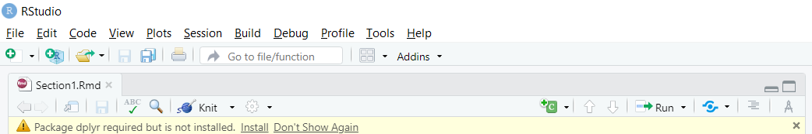

```{r setup, include=FALSE}
knitr::opts_chunk$set(echo = TRUE)
```

# Introducción a R

## Instalación e Interfaz

Lo primero que debe hacer para empezar a utilizar **R** es instalarlo en su ordenador. **R** funciona en casi todas las plataformas disponibles, incluidos los sistemas **Windows, Mac OS X** y **Linux**. Links de descarga para [R](https://cloud.r-project.org/) y [RStudio](https://www.rstudio.com/products/rstudio/download/). 

**RStudio** es un entorno de desarrollo integrado (**IDE**) disponible para **R**, el cual tiene un buen editor con resaltado de sintaxis, un visor de objetos de **R** y un gran número de características agradables que están integradas.

# Gestión de Data Frames con el paquete paquete dplyr

## Data Frames

El *data frame* es una estructura de datos clave en estadística y en **R**. La estructura básica de un *data frame* es que hay una observación por fila y cada columna representa una variable, medida, rasgo o característica de esa observación. **R** tiene una implementación interna de los *data frame* que es probablemente la que se utiliza con más frecuencia.

## El paquete dplyr

El paquete **dplyr** fue desarrollado por Hadley Wickham de RStudio y es una versión optimizada y destilada de su paquete **plyr**. Una importante contribución del paquete **dplyr** es que proporciona una "gramática" (en particular, verbos) para la manipulación de datos y para operar con *data frames*. Con esta gramática, se puede comunicar de forma comprensible lo que se está haciendo a un *data frame*. Esto es útil porque proporciona una abstracción para la manipulación de datos que antes no existía. Otra contribución útil es que las funciones de **dplyr** son muy rápidas, ya que muchas operaciones clave están codificadas en **C++**.

## Gramática dplyr

Algunos de los "verbos" clave proporcionados por el paquete **dplyr** son

- *select*: devuelve un subconjunto de las columnas de un marco de datos, utilizando una notación flexible
- *filter*: extraer un subconjunto de filas de un marco de datos basándose en condiciones lógicas
- *arrange*: reordenar las filas de un marco de datos
- *rename*: renombrar las variables de un marco de datos
- *mutate*: añadir nuevas variables/columnas o transformar variables existentes
- *summarise/summarize*: generar estadísticas de resumen de diferentes variables en el
marco de datos, posiblemente dentro de los estratos
- *%>%*: el operador "pipe" se utiliza para conectar varias acciones verbales en una
tubería

## Propiedades comunes de la función dplyr

Todas las funciones que trataremos en este capítulo tendrán algunas características comunes. En particular,

1. El primer argumento es un *dataframe*.
2. Los argumentos siguientes describen qué hacer con el marco de datos especificado en el primer argumento, y puede referirse a las columnas del marco de datos directamente sin usar el operador $ (sólo use los nombres de las columnas).
3. El resultado de retorno de una función es un nuevo *dataframe*
4. Los *dataframes* deben estar correctamente formateados y anotados para que todo esto sea útil. En resumen, debe haber una observación por fila y cada columna debe representar un rasgo o característica de esa observación.

## Instalación del paquete dplyr

El paquete dplyr se puede instalar desde *CRAN* o desde *GitHub* utilizando el paquete **devtools** y la función **install_github()**. El repositorio de *GitHub* suele contener las últimas actualizaciones del paquete y la versión de desarrollo. 

- Para instalarlo desde *CRAN*, basta con ejecutar

```{r eval=FALSE}
install.packages("dplyr")
```

- Para instalar desde *GitHub* puedes ejecutar

```{r eval=FALSE}
install_github("hadley/dplyr")
```

- Después de instalar el paquete es importante que lo cargues en tu sesión de **R** con la función **library()**

```{r}
library(dplyr)
```

- Si la instalación de **dplyr** no fué realizada correctamente, un mensaje de instalación requerida aparecerá resaltado en amarillo en la parte superior de **RStudio**. Haga click en **Install** y espero un momento mientras se lleva a cabo la instalación. Puede usar también esta estrategia de instalación en lo que sigue



- **NOTA**: Si alguna vez se encuentra con un problema en el que **R** se confunde sobre qué función que quiere llamar, puede especificar el nombre completo de una función utilizando el operador **::**. Por ejemplo, la función de **filter** del paquete **dplyr** tiene el nombre completo **dplyr::filter**. Llamar a las funciones con su nombre completo resolverá cualquier confusión sobre la función a la que se quiere llamar.

## select()

Para los ejemplos de este capítulo utilizaremos un conjunto de datos que contiene información sobre la contaminación del aire y la temperatura de la ciudad de Chicago